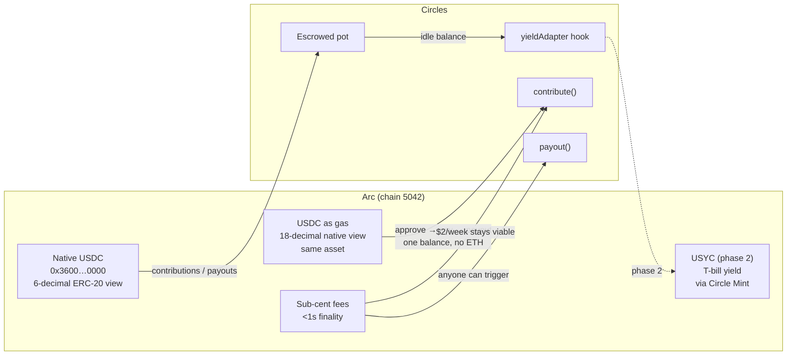
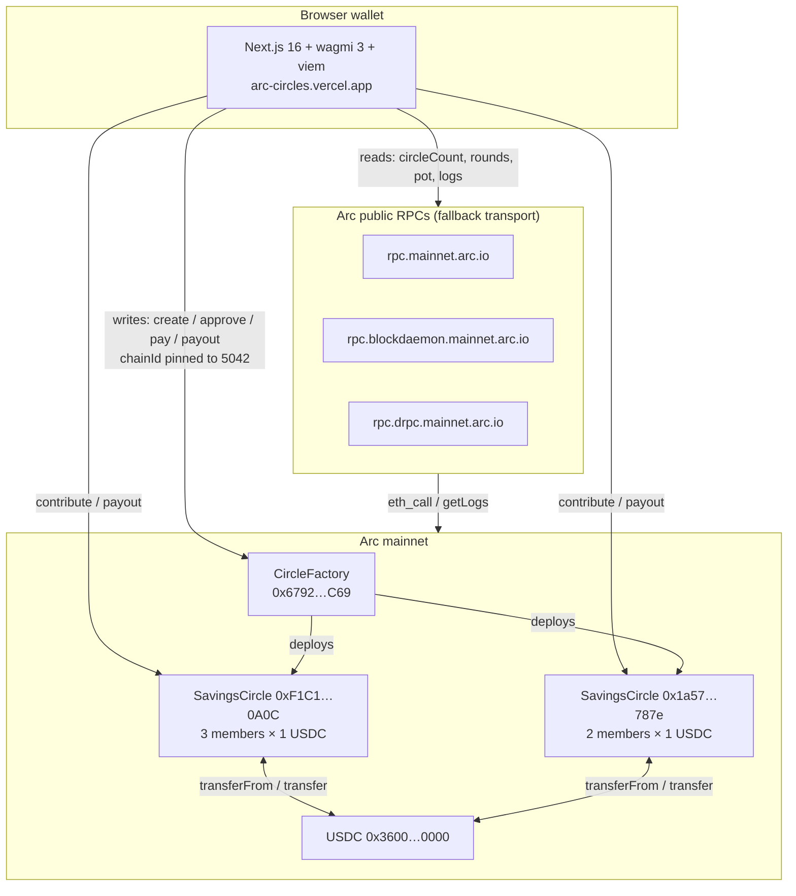
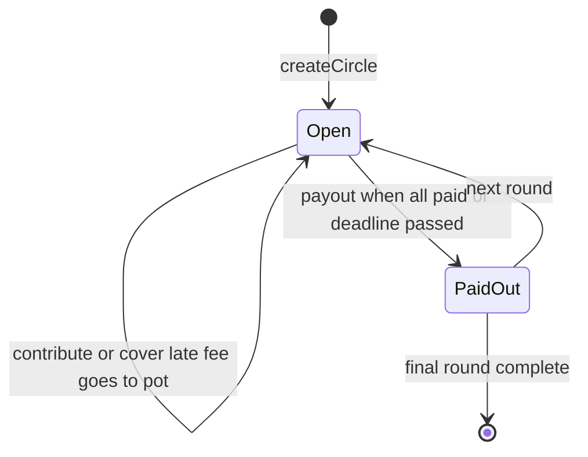

# Circles — Rotating Savings on Arc

Onchain rotating savings circles (ROSCA) settled in **native USDC on [Arc](https://arc.network)** (chain 5042). Fixed members, fixed payout order, late fees shared with the group — a savings habit for people the banking system prices out, running on rails where a $2 weekly contribution isn't eaten by fees.

**Live:** https://arc-circles.vercel.app · **Contracts (Arc mainnet):** factory [`0x6792E51FBD24f9315282BD5b6c5E713dCc779C69`](https://explorer.arc.io/address/0x6792E51FBD24f9315282BD5b6c5E713dCc779C69) · **Track:** Arc Microgrants (DoraHacks, deadline Oct 14 23:59 ET)

---

## What

A **ROSCA (rotating savings and credit association)** — one of the oldest financial instruments on earth. A group of N people each contributes a fixed amount every round; each round one member takes the whole pot. No interest, no lender, no collateral — the social bond *is* the collateral. An estimated [2.5B+ people](https://en.wikipedia.org/wiki/Rotating_savings_and_credit_association) save this way (tandas, arisan, chit funds, susus).

Circles moves that ceremony onchain with two trust upgrades over the informal version:

1. **Escrowed pot** — contributions lock in the contract; the organizer can't run with the money.
2. **Late-fee sharing** — pay after the deadline and a 5% penalty stays in the pot, so punctual members *earn* from late ones instead of just resenting them.

Core mechanics (`src/SavingsCircle.sol`):

- `createCircle(token, contribution, roundDuration, members, penaltyBps)` → deploys a circle via `CircleFactory`, payout order = member order.
- `contribute()` / `contributeFor(member)` → pay your share, or cover someone else's (mirrors how real circles work — a cousin covers you, you settle later).
- `payout()` → permissionless; fires when everyone paid **or** the deadline passes. Recipient must be paid up through this round (covered payments count).
- `setYieldAdapter` / `moveToYield` → phase-2 hook for yield (see Roadmap). Zero address today = 1:1 holding, no mock yield ever reported.

---

## Why this exists (problem → users)

**Problem.** Half the world saves informally because formal banking is too expensive, too distant, or demands ID/papers they don't have. But informal circles have three failure modes: the organizer absconds, a member ghosts mid-cycle, and late payments have no consequence — so groups cap at high-trust family size and can't scale.

**Who it's for.**

| Persona | Story | Why onchain helps |
|---|---|---|
| **Migrant workers** (e.g. domestic helpers sending money home) | Pool $20/week with 5 friends; each month one person gets $400 for school fees | No bank account needed; escrow replaces the trusted-auntie single point of failure |
| **Gig / informal earners** | Smooth lumpy income into forced savings with peers | Late-fee sharing rewards discipline; onchain history builds a portable punctuality record |
| **Crypto-native savers** | Rotating savings without a spreadsheet + group-chat nagging | Permissionless payout, verifiable pot, cover-for-others built in |

**Design principles:** fixed rules over discretion (no admin keys, no randomness, no upgradeability — the contract *can't* change the deal); tiny amounts must stay viable (sub-cent fees or the product dies); social recovery over collateral (covering a member is a first-class operation, not an edge case).

---

## Why Arc — what the chain is actually used for

Circles isn't "deployed on Arc" as a checkbox. Four Arc-native properties are load-bearing — remove any one and the product breaks:



| Arc property | How Circles uses it | What breaks without it |
|---|---|---|
| **Native USDC as gas** (same asset, 18-decimal native view) | One balance to understand. Contributions, late fees, *and* gas all come from USDC — the approve → pay → payout flow never touches another token. No "you need ETH for gas" onboarding cliff. | Every new saver must acquire a volatile gas token first; support burden explodes. |
| **Sub-cent fees, <1s finality** | A $2/week circle is viable — a full 3-member round-trip costs fractions of a cent. Anyone can afford to trigger `payout()`, so liveness doesn't depend on one operator. | On L1, gas exceeds the savings. The product only works for whale-sized circles — defeating the purpose. |
| **EVM + 6-decimal USDC** | Standard stack (Foundry, viem, wagmi) with money that behaves like money. `fmtUSDC`/`parseUnits(·, 6)` throughout; gas math stays 18-decimal and separate — never double-counted. | Rebuilding tooling or papering over decimal bugs in other people's money. |
| **USYC path (Circle Mint, allowlisted)** | Phase 2: idle pots earn T-bill yield without leaving the Circle trust perimeter. The `IYieldAdapter` interface is already in the contract; only the allowlisted holder is missing — the pitch for the follow-on Circle Grant Program. | Yield means trusting a third-party farm. With USYC it stays inside Circle-issued assets. |

A ROSCA is pure coordination + tiny transfers — exactly the workload a stablecoin chain exists for, and exactly the workload legacy rails overcharge.

---

## Architecture

Three layers. No backend, no indexer, no admin — the chain *is* the backend.



**Contract state machine** (per circle — `currentRound` marches forward, never back):



**Key invariants** (enforced onchain, covered by tests):

- Payout order is fixed at creation — `recipientOf(r) = members[r % N]`. No randomness (Arc sets `PREV_RANDAO` to 0 anyway), no admin reassignment.
- The pot only ever flows to the round recipient — there is no withdraw path for anyone else, including the creator.
- Late penalties are computed from `block.timestamp > roundDeadline(r)` and stay in the pot; they can only enlarge future payouts.
- `penaltyBps ≤ 2000` (20% cap), `roundDuration ≥ 60s`, `members ≥ 2`, no duplicates, no zero addresses — all validated at creation.
- Yield functions revert (`NoAdapter`) until the creator sets an adapter — holding mode is the safe default.

**Frontend notes:**

- Reads go through a wagmi `fallback()` transport across 3 public RPCs (official endpoint has timed out under load before). QuickNode was deliberately excluded — its domain sits on common adblock lists (`ERR_BLOCKED_BY_CLIENT`).
- Every write pins `chainId: 5042` *and* pre-switches the wallet to Arc, so a tx can never silently land on Ethereum and burn real ETH gas.
- The activity feed reads `Contributed` / `PaidOut` logs directly via `getLogs` — no subgraph exists (or is needed) on a young chain.

---

## How it works (round lifecycle)

```
Round r (each `roundDuration` seconds)
  1. Every member calls contribute()  ── USDC → circle (late = +5% stays in pot)
     (anyone may contributeFor() an absent member)
  2. Anyone calls payout() once all paid OR deadline passes
     → whole pot → members[r]  (round advances, or circle completes)
```

**Walkthrough (3 members, 10 USDC/round):** Alice, Bob, Cara each approve 10.5 USDC (contribution + max penalty). Round 0: all three pay → anyone triggers payout → 30 USDC → Alice. Round 1 → Bob. Round 2 → Cara, circle completes. If Bob pays late in round 1, his 0.5 penalty stays in the pot — Alice already got hers, Cara's round is fatter.

**Try it live:**

1. Add Arc to your wallet: chain ID **5042**, RPC `https://rpc.mainnet.arc.io`, explorer `https://explorer.arc.io`. Fund with USDC on Arc ([bridge](https://bridge.circle.com)).
2. Open https://arc-circles.vercel.app, connect — the app pins chain 5042 and auto-switches.
3. Create a circle (members = one address per line, payout top→bottom), or open an existing one: `…/circle/0x…`.
4. Approve → Pay → (anyone) Trigger payout. Activity feed reads straight from contract logs — no subgraph needed.

**Local dev:**

```shell
forge build && forge test        # 9 tests, all green
cd web && npm install && npm run dev
```

Deploy: `forge script script/Deploy.s.sol --rpc-url https://rpc.mainnet.arc.io --broadcast`, then set `FACTORY_ADDRESS` in `web/lib/arc.ts`.

---

## Proven on mainnet (not a testnet demo)

- Factory `0x6792…C69` + two live circles on **Arc mainnet**, verified via `circleCount() == 2` against two independent RPCs.
- Circle `0xF1C1…0A0C` (3 members × 1 USDC): round 0 fully contributed and **paid out 3.0 USDC onchain** (contribute `0x6e18…86cae6`, payout `0x54bf…81a18f5e`, `currentRound == 1`).
- Circle `0x1a57…787e` (2 members × 1 USDC): round 0 paid out, on round 1/2.

---

## Vision & roadmap

**Vision.** Every informal savings circle on earth gets escrow, fair late-fee sharing, and a portable reputation — without ever touching a bank. Circles starts on Arc because stablecoin-native rails are the first place the math works at $2/week; the pattern generalizes to any group that saves together and settles in stablecoins.

| Phase | Scope | Status |
|---|---|---|
| **Now — Microgrants** | Live factory + web app, mainnet proof rounds, public repo. Single-token (USDC) by design. | ✅ shipped |
| **Next — reminders & reputation** | Per-member payment history → lightweight onchain punctuality score; circles can require a minimum score to join. Offchain cron pings members before deadlines (Farcaster/Telegram). | planned |
| **Phase 2 — yield (Grant Program pitch)** | Onboard operator via Circle Mint, point `yieldAdapter` at USYC so idle pots earn T-bill yield between rounds. Adapter interface already in the contract. | interface ready |
| **Later** | EURC circles for non-USD groups; multi-round auto-debit (EIP-7702 session intents); group discovery board. | explored |

**Non-goals (deliberate):** no oracles, no governance token, no upgradeable proxies, no cross-chain messaging — every dependency removed is a failure mode the savers never face.

---

## Repo map

```
src/SavingsCircle.sol      Circle + CircleFactory (no deps beyond forge-std in tests)
test/SavingsCircle.t.sol   9 forge tests (full lifecycle, penalties, reverts, gating)
script/Deploy.s.sol        factory deploy script
web/                       Next.js 16 + wagmi 3 + viem (no RainbowKit)
  lib/arc.ts               chain 5042, RPC fallbacks, USDC, ABIs
  lib/wagmi.tsx            fallback transport across 3 public RPCs
  components/CreateCircle  create flow (chain pinned to 5042)
  app/circle/[address]/    round dashboard, pay, payout, activity feed
broadcast/                 mainnet deploy receipts (committed as proof — safe, no keys)
```

## License

MIT — see [LICENSE](LICENSE).
